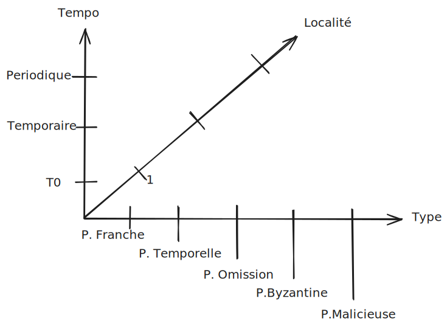
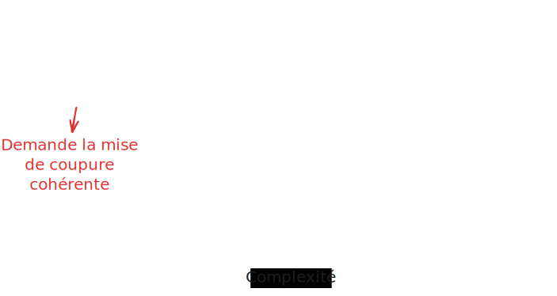
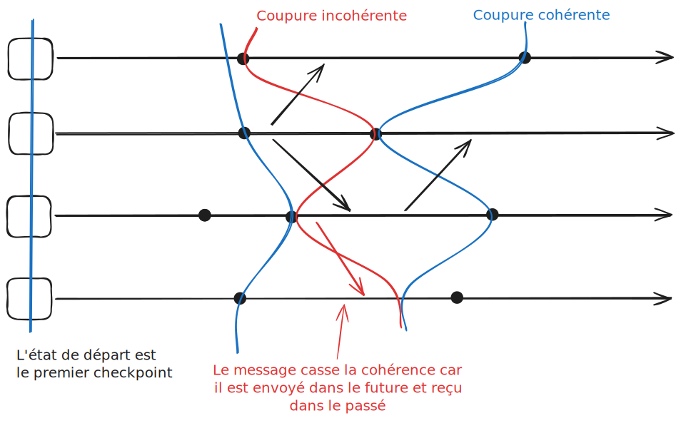

## Résumé des cours précédents

Algorithmes classiques :
- Élection de leader
- Consensus distribué

Construire un algorithme qui marche même quand il y a des pannes.

Algorithme basé sur des quorums : un ensemble de n nœuds

Les algorithmes tolérants aux fautes ont un coût supplémentaire lors de l'exécution :
- Mémoire
- Temps
- Messages

Abstraction des détecteurs

> [!IMPORTANT]
> MTBF : Mean Time Between Failures : Temps moyen entre deux pannes

Les pannes peuvent être classées en différentes catégories selon : 
- leur type
- la localité
- la temporalité

### Types de fautes
Il existe plusieurs types de fautes :
*faute franche* : arrêt définitif du composant, qui ne répond plus ou ne transmet plus
*faute d'omission* : un résultat ou un message n'est pas délivré temporairement
*faute temporelle* : un résultat ou un message est délivré trop tard ou trop tôt 
*faute byzantine* : inclut tous les types de fautes, y compris le fait de délivrer un résultat ou un message erroné (intentionnellement ou non)

> [!NOTE]
> La complexité est croissante, chaque catégorie de faute inclut les précédentes.

Si on sort de la spécification, on parle de faute byzantine.

### Localité
Ce que cela peut toucher — le nombre de machines affectées.

### Temporalité
*faute permanente* : le composant reste en faute indéfiniment
*faute temporaire* : le composant est en faute pendant une période limitée
*faute intermittente* : le composant alterne entre des périodes de fonctionnement correct et des périodes de faute

## Checkpointing

L'idée du checkpointing est de sauvegarder périodiquement l'état d'un système pour pouvoir le restaurer en cas de panne.

Les checkpoints sont des états locaux sauvegardés par chaque processus.

> [!NOTE]
> Côté système, les sauvegardes sont faites avec un fork.

### Types de checkpointing

- Non coordonné : chaque processus décide lui-même du moment où effectuer un checkpoint.
- Coordonné : tous les processus coordonnent leurs checkpoints pour garantir une vue cohérente du système.
    - implicite : les processus n'ont pas besoin de communiquer explicitement pour coordonner leurs checkpoints.
    - explicite : les processus communiquent pour s'assurer que les checkpoints sont pris de manière coordonnée.
        - Non bloquant : Les processus peuvent continuer à fonctionner pendant que les checkpoints sont pris.
        - Bloquant : Les processus doivent s'arrêter temporairement pour prendre les checkpoints.

### Coupure

Dépend d'un événement qui n'appartient pas à l'historique de la coupure.

Une coupure est cohérente si :
1) Tous les messages émis avant la coupure sont soit reçus avant la coupure, soit en transit.
2) Tous les messages émis après la coupure sont reçus après la coupure.

