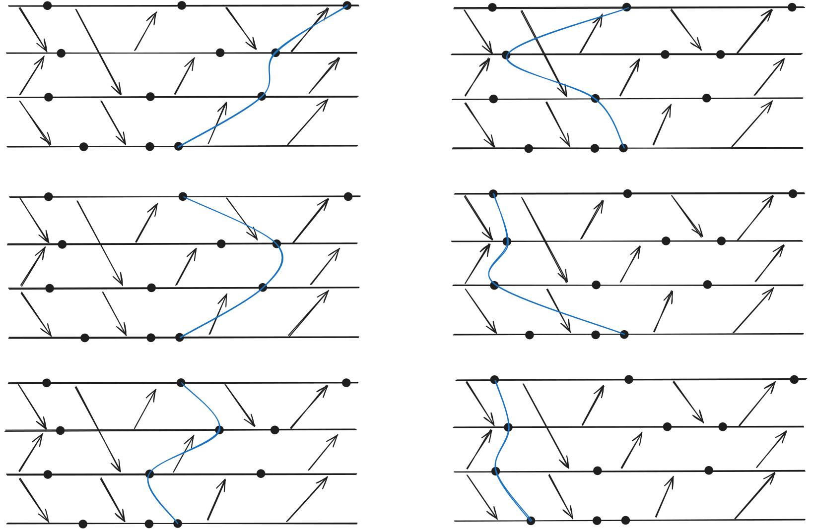
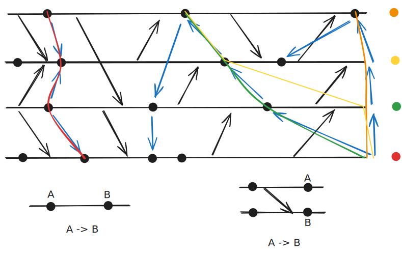

## Résumé des cours précédents

Algorithmes classiques :
- Élection de leader
- Consensus distribué

Construire un algorithme qui fonctionne même en présence de pannes.

Algorithme basé sur des quorums : un ensemble de n nœuds

Les algorithmes tolérants aux fautes ont un coût supplémentaire lors de l'exécution :
- Mémoire
- Temps
- Messages

Abstraction des détecteurs

> [!IMPORTANT]
> MTBF (Mean Time Between Failures) : temps moyen entre deux pannes

Les pannes peuvent être classées selon :
- leur type
- la localité
- la temporalité

### Types de fautes
Il existe plusieurs types de fautes :
*faute franche* : arrêt définitif du composant, qui ne répond plus ou ne transmet plus
*faute d'omission* : un résultat ou un message n'est pas délivré temporairement
*faute temporelle* : un résultat ou un message est délivré trop tard ou trop tôt 
*faute byzantine* : inclut tous les types de fautes, y compris le fait de délivrer un résultat ou un message erroné (intentionnellement ou non)

> [!NOTE]
> La complexité est croissante, chaque catégorie de faute inclut les précédentes.

Si un composant ne respecte pas la spécification, on parle de faute byzantine.

### Localité
Ce que cela peut toucher — le nombre de machines affectées.

### Temporalité
*faute permanente* : le composant reste en état de faute indéfiniment
*faute temporaire* : le composant est en faute pendant une période limitée
*faute intermittente* : le composant alterne entre des périodes de fonctionnement correct et des périodes de faute

## Checkpointing

L'idée du checkpointing est de sauvegarder périodiquement l'état d'un système afin de pouvoir le restaurer en cas de panne.

Les checkpoints sont des états locaux sauvegardés par chaque processus.

> [!NOTE]
> Côté système, les sauvegardes sont faites via un fork.

## Types de checkpointing

- Non coordonné : chaque processus décide lui-même du moment où effectuer un checkpoint.
- Coordonné : tous les processus coordonnent leurs checkpoints pour garantir une vue cohérente du système.
    - implicite : les processus n'ont pas besoin de communiquer explicitement pour coordonner leurs checkpoints.
    - explicite : les processus communiquent pour s'assurer que les checkpoints sont pris de manière coordonnée.
        - Non bloquant : Les processus peuvent continuer à fonctionner pendant que les checkpoints sont pris.
        - Bloquant : Les processus doivent s'arrêter temporairement pour prendre les checkpoints.

## Coupure

Une coupure dépend d'un événement qui n'appartient pas à l'historique de la coupure.

Une coupure est cohérente si :
1) Tous les messages émis avant la coupure sont soit reçus avant la coupure, soit en transit.
2) Tous les messages émis après la coupure sont reçus après la coupure.

## Algorithmes de coupures cohérentes

Les coupures sont difficiles à déterminer.
Il y a donc deux algorithmes pour y parvenir :

### Algorithme sur le checkpoint graphe 

1) Marquer en rouge les pannes (ou états crashés).
2) Former une coupure en regroupant tous les états (sans checkpoint).
3) Tant qu'il existe un état c appartenant à la coupure : marquer c en rouge
    - Prendre le prédécesseur local de c
    - Marquer en rouge tous les nœuds qui dépendent de la coupure

> [!CAUTION]
> On doit connaitre cette algo pour l'examen

### Rollback-dependence graphe

## Les Z chemins

Z Path de A à B : A -z-> B

1) demande des futures de A  .-->

2) 
    - localement : 
        Vers avant : Vers future : `-->`
        Vers arrière : Vers passé : `<--` 
        mais ne peut pas franchir les checkpoints

    - Prend les message. Vers avant : Emission --> Réception

2) finir par le passé de B : --> B

> [!IMPORTANT]
> Théorème des chemins en Z :
> - Une coupure est incohérente s'il existe un Z chemin entre deux checkpoints de cette coupure.
> - Une coupure est cohérente si et seulement si il n'existe pas de chemin en Z entre deux checkpoints de la coupure.
> - Si un chemin en Z existe entre c_a et c_b, alors ces deux checkpoints ne peuvent pas faire partie de la même coupure.

