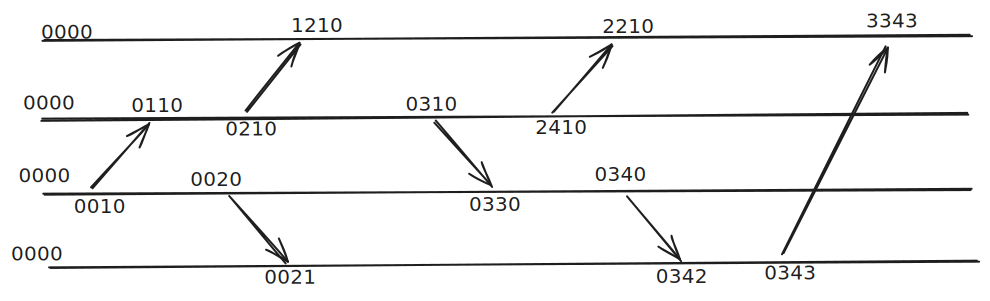
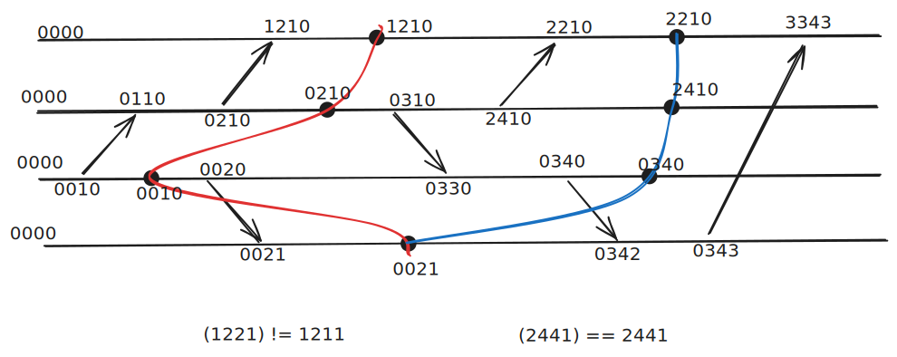
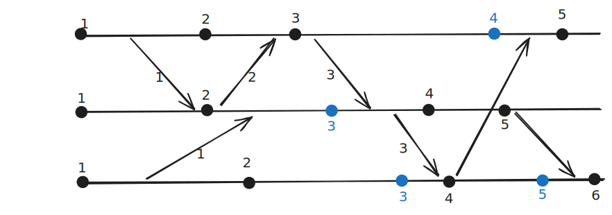
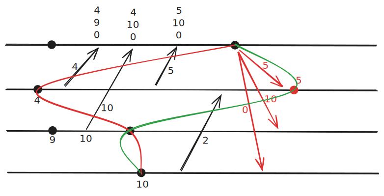
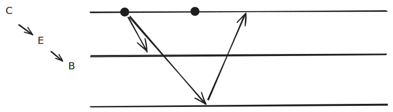

## Rappel sur les horloges vectorielles

Chaque processus maintient un vecteur d'horloge de taille n (nombre de processus).
Lorsqu'un processus envoie un message, il incrémente sa propre entrée dans le vecteur et joint une copie du vecteur au message.

> V1 \<= V2 ssi pour tout i, V1[i] \<= V2[i]

> V1 < V2 ssi V1 \<= V2 ^ V1 != V2

> V1 || V2 ssi !(V1 < V2) ^ !(V2 < V1)

## Consistance globale

L'heure d'une coupure est définie comme le maximum des horloges locales des processus à ce moment-là.

Il faut vérifier que pour chaque processus, l'horloge locale au moment du checkpoint est inférieure ou égale à l'heure de la coupure.

Horloge du bleu : 2441     ==  2441
Horloge du rouge : 1221    !=  1211

... : Dépendances graphes
... : Les Z chemins
Prouvez coupure cohérente : utiliser les horloges vectorielles.

## Sauvegarde 

### Algorithme de Briato (1984)

On ajoute pas de messages supplémentaires. Il est **implicite**.
Mais on peut ajouter des informations dans les messages existants.
Ici on ajoute une horloge de Lamport dans chaque message.

> Si on reçoit un message avec une horloge plus grande que notre horloge locale, on crée un checkpoint avant de traiter le message.

Il crée beaucoup de checkpoints inutiles.

### Algorithme Luy Yang (1987)

On ajoute des messages supplémentaires. Il est **explicite non bloquant**.

C'est Non FIFO : Luy Yang (1987)

Si les cannaux son FIFO c'est pas suffisant car dans un triangle on peut avoir des messages qui se croisent.

### Algorithme Koo-Toueg (1987)

## Définitions

Propriétés des transactions en bases de données.

CAP : Consistency, Availability, Partition tolerance
On ne peut pas avoir les 3 en même temps.

ACID : Atomicity, Consistency, Isolation, Durability
Atomicity : une transaction est une unité indivisible qui réussit ou échoue dans son ensemble.
Consistency : une transaction doit amener la base de données d'un état cohérent à un autre état cohérent.
Isolation : les transactions concurrentes ne doivent pas interférer entre elles.
Durability : une fois qu'une transaction est validée, ses effets sont permanents.

### 3 PC : 3 Phase Commit

Chlt Req => Chpt Ready
Chpt Do => Chpt Done
Chpt Commit 
