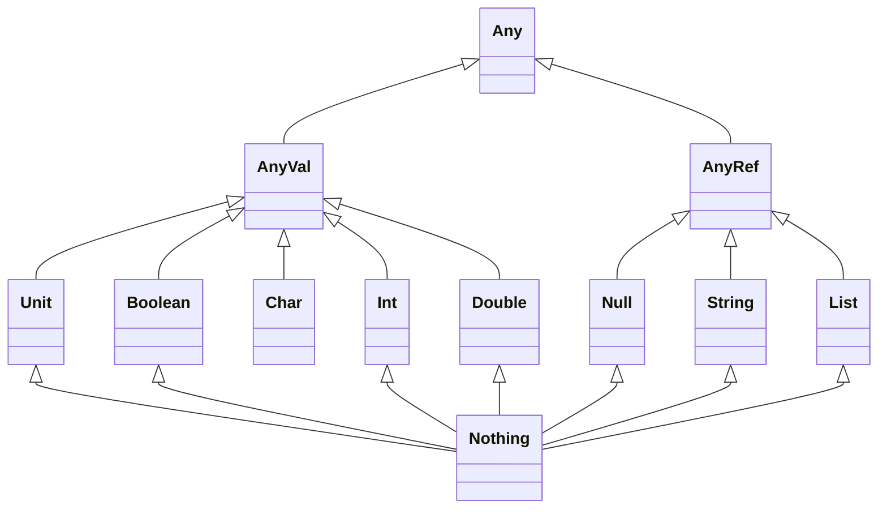

import NoteTag from '../../../../components/NoteTag.astro';

Scala is a strong statically typed programming language that combines object-oriented and functional programming paradigms. It is designed to be concise, elegant, and expressive, making it a popular choice for building scalable applications.

## Scala Type Hierarchy

## Key Features of Scala

> [!NOTE]
> En Scala les type utilisent des [ ] à la place des < > comme dans tous les putains d'autres langages du mooonnde !!!

fwefwef
wef

>fewfwef
wefwef
