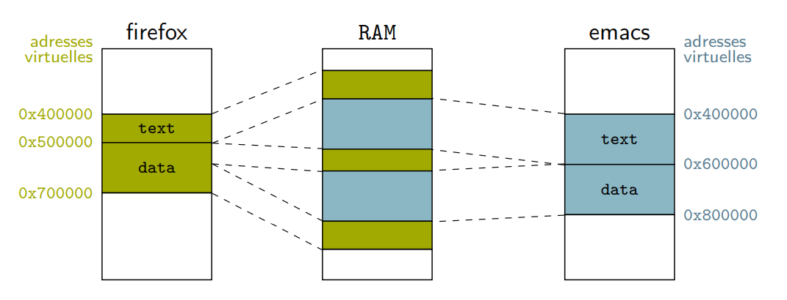

## Rappel 

**La pile (stack)** :
- Sommet de la pile stocké dans un registre dédié
- Gestion par les prologue / épilogue des fonctions
- Générés à la compilation

**Le tas (heap)** :
- Gestion dynamique de la mémoire
- Gestion par une librairie dédiée : glibc par défaut
- Modifiable au lancement du programme (LD_PRELOAD, etc.)

> [!NOTE]
> LD_PRELOAD permet de charger une bibliothèque avant toutes les autres, utile pour remplacer des fonctions standard comme malloc/free.
> C’est un outil de debug non intrusif très utilisé.


### malloc, free

```c
void* malloc(size_t size);
```

Malloc n'est pas un appel système c'est une fonction userland.
Il demande de la mémoire avec sbrk/mmap et retourne de petites portions. 
La gestion de la fragmentation se fait en userland.

### Compilation et adressage

Le compilateur attribue des adresses *static* à tous les symboles lors de l'édition de liens.

Le programmeur peut ensuite choisir de compiler avec des adresses relatives (PIE) ou absolues.

- Adressage absolu → le code doit être chargé à une adresse précise
- Adressage relatif → le code doit être chargé dans le bon ordre

## La MMU (Memory Management Unit)

La MMU est un composant matériel qui permet de traduire les adresses virtuelles(coté CPU) en adresses physiques(coté RAM).

Elle utilise une table de traduction :




Un programme doit être chargé à une adresse virtuelle précise
- La MMU définie le placement en mémoire physique à l’exécution

- La MMU peut-être reconfigurée à la commutation car d’un processus à un autre les adresses virtuelles sont traduites différemment

La traduction permet de pouvoir modifier l'emplacement mémoire d'un programme sans le recompiler et sans qu'il s'en rende compte.


